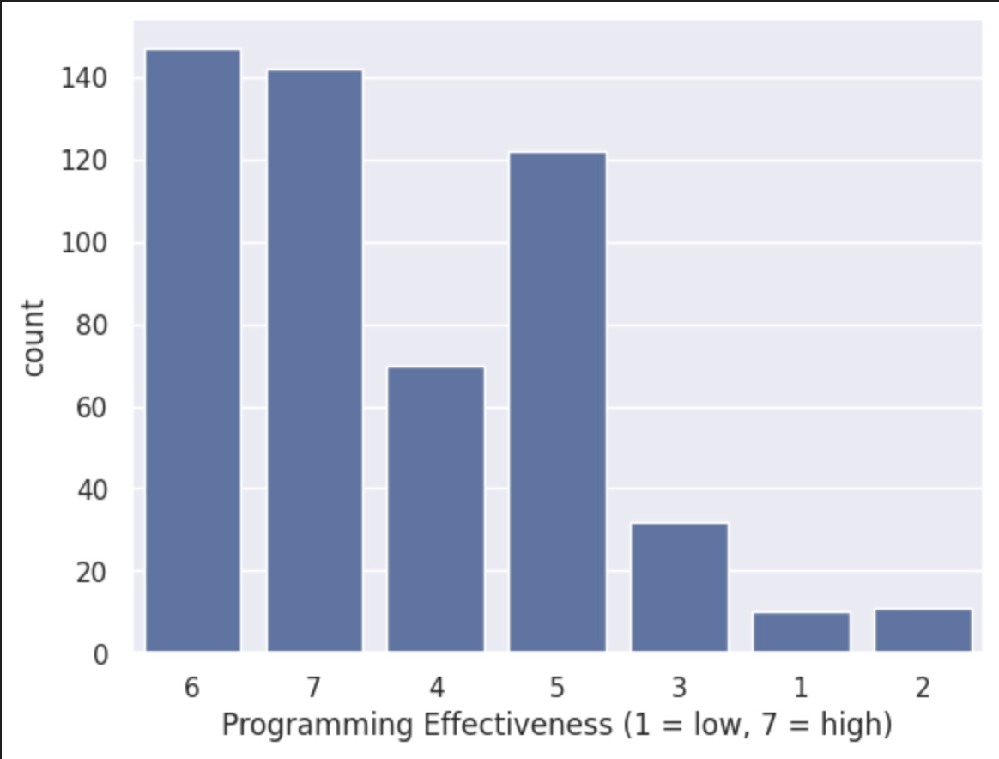
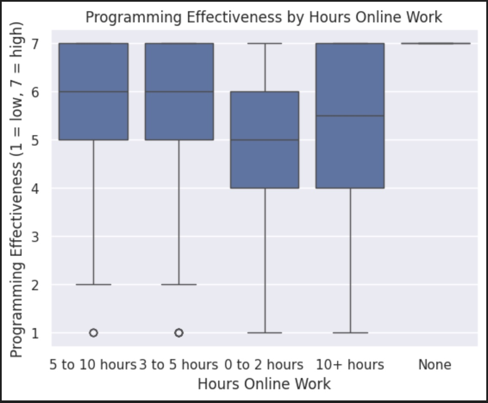
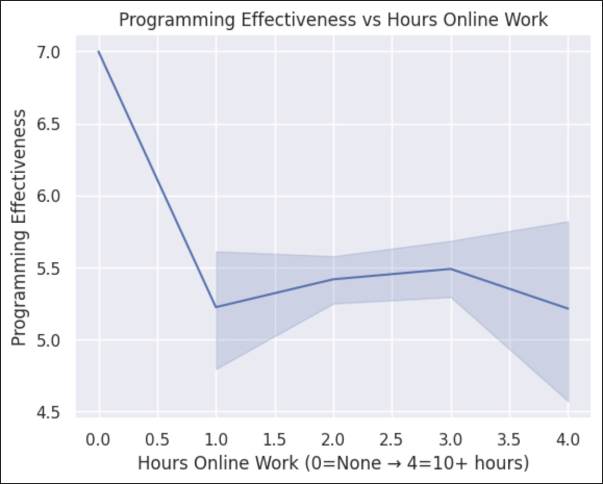

---
# Do not edit the text between these lines!
layout: default
---

Would adding more class time for programming in python be effecient for student learning?

<!-- This is a comment. Below, you'll see code for inserting an image. To make this image appear, update <custom-path>. To add an image, save it inside the imgs folder of this repository. -->

## This is a small header

The goal of this analysis was to determine if increasing the amount of class time for active Python coding would improve student learning. Specifically, we examined the data provided for overall programming assignment effectiveness and the hours students spent online. We wanted to see if there was any correlation among the two variables. Additionally, we looked at the data on a broader scale, seeing how COMP110 students rated the overall effectiveness of programming assignments. 